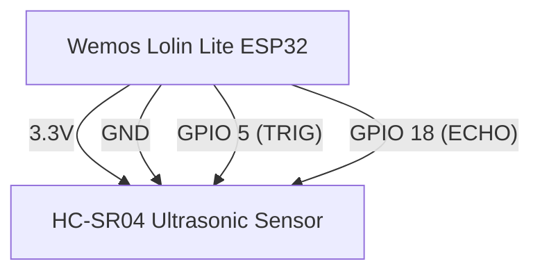

# ESP32 IoT Device Wiring Diagram

## Components
- Wemos Lolin Lite ESP32
- Ultrasonic Sensor (HC-SR04)
- Power supply (USB or battery)

## Pin Connections
| Component      | ESP32 Pin | Description |
|---------------|-----------|-------------|
| HC-SR04 VCC   | 3.3V      | Power supply |
| HC-SR04 GND   | GND       | Ground |
| HC-SR04 TRIG  | GPIO 5    | Trigger signal |
| HC-SR04 ECHO  | GPIO 18   | Echo signal |

## Wiring Instructions
1. Connect HC-SR04 VCC to ESP32 3.3V
2. Connect HC-SR04 GND to ESP32 GND
3. Connect HC-SR04 TRIG to ESP32 GPIO 5
4. Connect HC-SR04 ECHO to ESP32 GPIO 18

## Mermaid Diagram

## Distance Thresholds
- **Empty**: Distance ≥ 20cm (bin is empty)
- **Partial**: Distance between 5-20cm (bin is partially full)
- **Full**: Distance ≤ 5cm (bin is full)

## Configuration
- Update `deviceId` and `deviceLocation` in the code for each device
- Update Wi-Fi credentials (`ssid` and `password`)
- Adjust distance thresholds if needed for your specific setup 