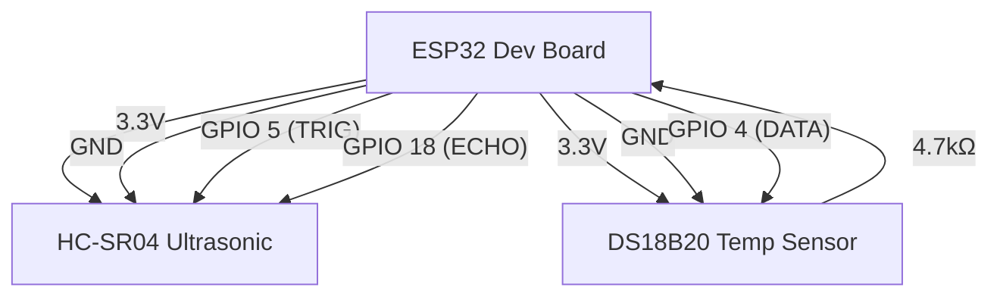

# Smart Bin Wiring Diagram

## Components
- ESP32 Dev Board
- Ultrasonic Sensor (HC-SR04)
- (Optional) Temperature Sensor (DS18B20)
- 4.7kΩ resistor (for DS18B20)
- Power supply (USB or battery)

## Pin Connections
| Component      | ESP32 Pin Example |
|---------------|------------------|
| HC-SR04 VCC   | 3.3V             |
| HC-SR04 GND   | GND              |
| HC-SR04 TRIG  | GPIO 5           |
| HC-SR04 ECHO  | GPIO 18          |
| DS18B20 VCC   | 3.3V             |
| DS18B20 GND   | GND              |
| DS18B20 DATA  | GPIO 4           |

- Place a 4.7kΩ resistor between DS18B20 DATA and VCC.

## Mermaid Diagram
